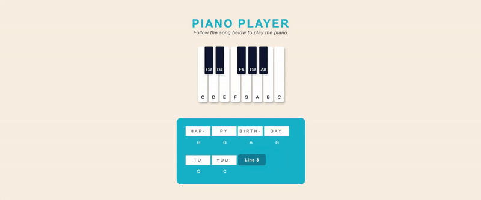

# Happy Birthday Piano Player
An interactive mini-game to help beginner piano students learn and practice.

This project is a piano player built with HTML, CSS, and JavaScript, using DOM events to play notes.
It’s part of my learning journey on the Front-End path with [Codecademy](https://www.codecademy.com). 

## Features
- Shows how to play the melody of “Happy Birthday"
- Interactive, beginner-friendly design
- Clean and simple code structure for learning DOM events

## Further Improvements
- Add audio sounds for each key

### Created by [kolonatalie](https://github.com/kolonatalie)
I’m always open to feedback and collaboration!

- **[LinkedIn](https://www.linkedin.com/in/kolonatalie/)**
- **[Bluesky](https://bsky.app/profile/kolonatalie.bsky.social)**
- **[Mastodon](https://mastodon.social/@kolonatalie)**