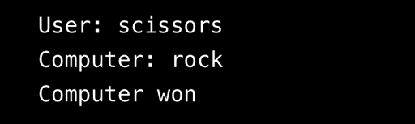

# 🕹️ Rock, Paper, or Scissors Game (+ Secret Mode)

A classic console-based implementation of the Rock, Paper, Scissors game using JavaScript. This project focuses on **functional decomposition** and complex **conditional logic** to determine the winner.

---

## Game Logic

The game uses three primary functions to manage the gameplay flow:

1.  **`getUserChoice(userInput)`:** Validates the player's input, converting it to lowercase. It accepts the standard three options plus a secret option.
2.  **`getComputerChoice()`:** Generates a random choice (`rock`, `paper`, or `scissors`) using `Math.random()`.
3.  **`determineWinner(userChoice, computerChoice)`:** Contains the core game logic to compare choices and declare the outcome.
4.  **`playGame()`:** Coordinates the process, logs the choices, and calls the winner determination function.

### Rules
* **Rock** beats Scissors.
* **Scissors** beat Paper.
* **Paper** beats Rock.
* **Tie** if both players choose the same item.
* **✨ Secret Lava Mode:** Choosing `lava` results in an automatic win for the user, as nothing can beat lava!

## ⚙️ Technical Highlights

This project demonstrates strong foundational JavaScript skills in:

* **Functional Decomposition:** Breaking the game into separate, manageable functions for input, random choice, and logic.
* **Conditional Statements:** Extensive use of nested `if/else if/else` statements in `determineWinner` to cover all 9 potential standard outcomes, plus the special lava case.
* **Randomization:** Utilizing `Math.random()` and `Math.floor()` to simulate the computer's unpredictable choice.
* **Input Validation:** The `getUserChoice` and `playGame` functions include robust checks to handle invalid user input.

## Getting Started

This is a console application and requires **Node.js** to run.

1.  Navigate into the project directory:
    ```bash
    cd Rock-Paper-or-Scissors-JS
    ```
2.  Run the JavaScript file using Node:
    ```bash
    node index.js
    ```

## 🖼️ Console View Examples
The following screenshots demonstrate the various outcomes of the game:





### Lava Mode & Error Handling


## Potential Extension

* **User Interface (HTML/CSS):** Convert the game from a console app to an interactive web page, allowing the user to click buttons instead of modifying the hardcoded input.

***

*Created by [kolonatalie](https://github.com/kolonatalie) • Connect: [LinkedIn](https://www.linkedin.com/in/kolonatalie/) | [Portfolio](https://kolonatalie.github.io/portfolio/)*