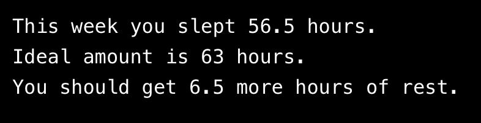

# Sleep Debt Calculator

- The code determines the actual and ideal hours of sleep for each night of the week.
- Then, it calculates how many hours the user is away from their weekly sleep goal.

## Console view

## Further Improvements

- User Interface (HTML/CSS).
- Error Handling and Input Validation: Implement more robust error handling to manage invalid user inputs (e.g., non-numeric values for sleep hours).